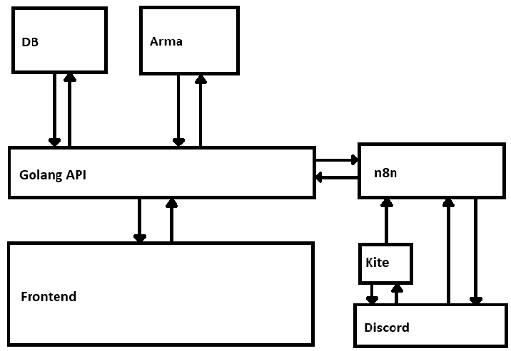

# Crusader Backend
### Abstract
Das Crusader Backend ist der Versuch, verschiedene Prozesse zu etablieren, bestehende zu automatisieren und durch ein Datenbanksystem eine Redundanz-arme und Inkonsistenz-freie Speicherung umzusetzen. 

## Tech-Stack aka the nerdy Part

### Overview:
 - Frontend (Svelte 5)
 - Backend (GO & OpenAPI)
 - Datenbank (Postgres)
 - Backend auf Arma Server (C#) wird in Zukunft benutzt
 - Workflow and Automation (n8n)
 - Discord Bots (Kite)

### Frontend
 - Svelte 5, Svelte-Kit + TS
 - TailwindCSS, Bits-UI, Phosphor Icons
 - OpenAPI, SSO Discord
 - für CRUD-Operations mit cooler Datenvisualisierung
 - LLM Usage ist erlaubt

### Backend
 - GOLANG 1.24 (mby 1.25)
 - ORM: GORM
 - oapi-codegen
 - LLM Usage ist nicht gewollt

### Datenbank
 - Postgres

### Arma Server
 - vermutlich in C#
 - wird als externes System angesehen
 - vielleicht als Übergang GO Skript auf Server, welches Server Logs liest um Daten zu parsen und zu senden

### n8n
 - no Code System für literally alles
 - Anwendungsfall: Discord, Telegram, externe APIs für Automatisierung
   - Bei DC Änderung einfach anzupasen, ggf. zB von Mia, da no-Code
 - Nicht gedacht für: DB Zugriffe, Frontend->Backend etc. (siehe Communication)

### kite
 - no Code Discord Bots
 - Für DC User Interaktion
 - wenig Logik implementierbar
 - kann API Requests abschicken aber nicht durch Webhook getriggert werden

### Deployment
 - Docker Compose (Frontend, Backend, DB, n8n, kite)
 - FE und BE werden Dockerized

### Communication

